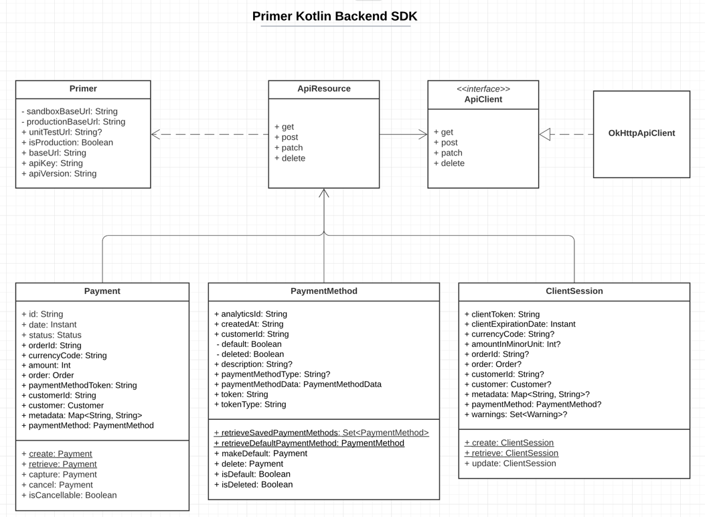

# Primer Kotlin Backend SDK
Playground project for an SDK for payment gateway service Primer. Enables interacting with Primer.io from a backend service.

## Architectural overview


## Example usage
```kotlin
val customerId = "customerId"
val defaultPaymentMethod = PaymentMethod.retrieveDefaultPaymentMethod(customerId)
val payment = Payment.create(
    CreatePaymentDto(
        paymentMethodToken = defaultPaymentMethod.token,
        amount = 10000,
        currencyCode = "SEK",
        orderId = UUID.randomUUID().toString(),
        customerId = customerId,
    ),
)
payment.capture()
```